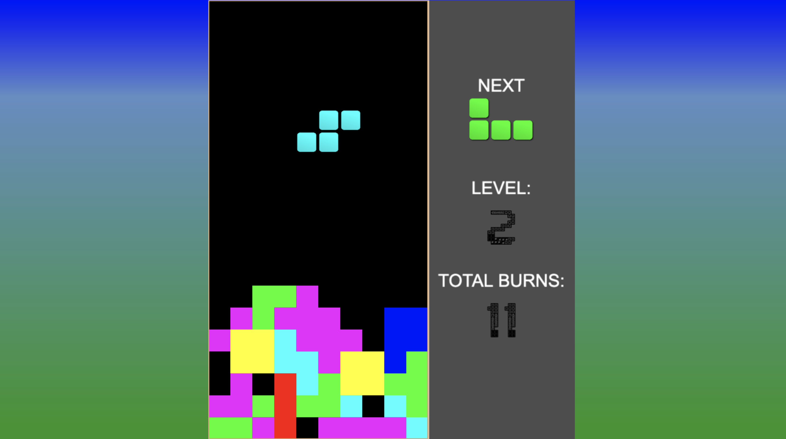

# Tetris
A simple, windows95-looking 10 x 20 tetris game.



### [Live Demo](http://maks-k.github.io/tetris/ "Tetris")

---

### Running locally:
1. Clone this repository
2. Install dependencies - ```npm install```
3. Build thee game - ```npm run build```
4. Run the game on any available webserver
   
---

### Features
- Showing the next tetromino in the queue
- Different levels (with different speed)
- Total score presenting
- Originally 10 x 20 bricks, but can be configurable to any dimensions

### Controls
- ROTATE = "Space",
- DOWN = "ArrowDown",
- LEFT = "ArrowLeft",
- RIGHT = "ArrowRight"

### Todo
- sounds
- mobile interactions support
- proper start/end game screens
- animations?
